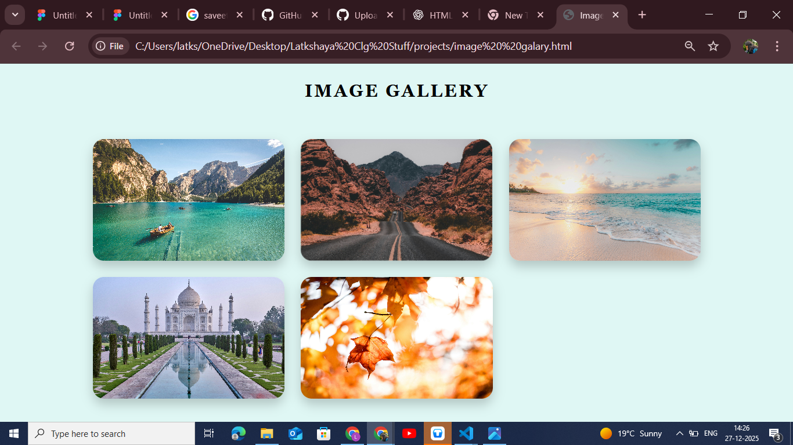

# Ex.08 Design of Interactive Image Gallery
# Date:13.12.2025
# AIM:
To design a web application for an inteactive image gallery with minimum five images.

# DESIGN STEPS:
## Step 1:
Clone the github repository and create Django admin interface.

## Step 2:
Change settings.py file to allow request from all hosts.

## Step 3:
Use CSS for positioning and styling.

## Step 4:
Write JavaScript program for implementing interactivity.

## Step 5:
Validate the HTML and CSS code.

## Step 6:
Publish the website in the given URL.

# PROGRAM :
'''
<!DOCTYPE html>

    
</head>

<body>

    <h1>IMAGE GALLERY</h1>

    

        
        
        
        
        
    

</body>
</html>

   
'''
# OUTPUT:
# RESULT:
The program for designing an interactive image gallery using HTML, CSS and JavaScript is executed successfully.
